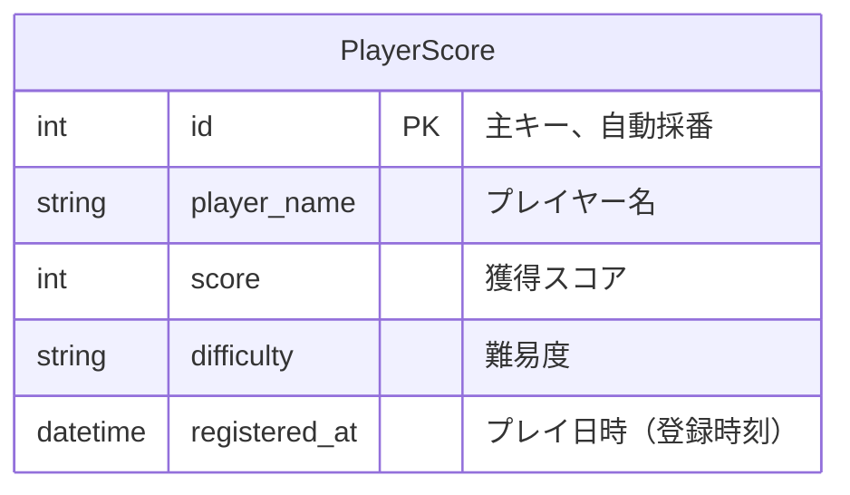
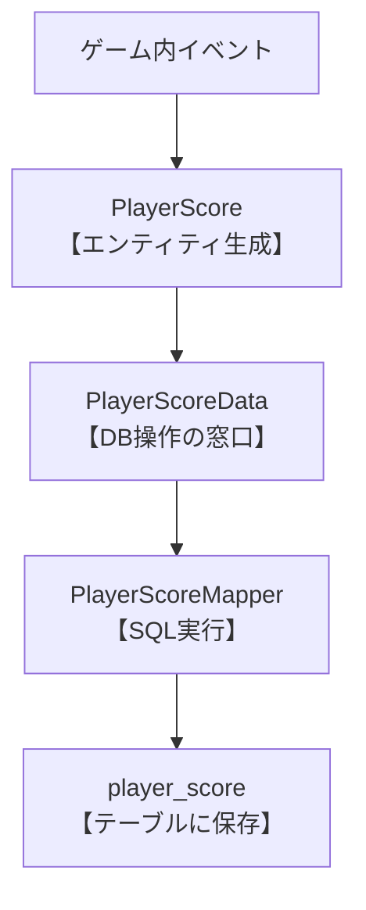

## はじめに
- 本リポジトリは、Java を用いた個人開発として  Seiya が作成した Minecraft プラグイン「EnemyDown」に関するものです。
- ご利用いただくことによるトラブル等につきましては、一切の責任を負いかねますことを予めご了承ください。

## 主な使用技術・環境

| |技術・環境   |
|-----|-----|
| バックエンド | |
| アプリケーション | |
| サーバー | |
| データベース | | 
| 使用ツール |&nbsp;&nbsp;| 

## 制作背景
- Java およびデータベースを用いたバックエンド処理を設計・実装する題材として、  処理結果を視覚的に確認しやすい<br>
  Minecraft プラグインを選定しました。

- Spigot API を用い、ゲーム内イベントを起点とした処理フローと、  スコア情報を管理するシステムを設計・実装しています。


## プレイ動画（easyバージョン）
**難易度に応じて出現する敵の種類を切り替え、各難易度内ではランダムに敵が出現する仕様としています。<br>
この設計により、難易度ごとの差を保ちつつ、単調にならないゲーム体験を意識しました。**

https://github.com/user-attachments/assets/b56741cf-7af8-4597-b91f-425b6dd1e774

- 敵の出現ロジックは、難易度ごとにリストを定義し、その中からランダムで1体を選択する形にすることで、<br>
  拡張しやすい構成としています。
```java
  private EntityType getEnemy(String difficulty) {
    List<EntityType> enemyList = switch (difficulty) {
      case NORMAL -> List.of(EntityType.ZOMBIE, EntityType.SKELETON);
      case HARD -> List.of(EntityType.ZOMBIE, EntityType.SKELETON, EntityType.WITCH);
      default -> List.of(EntityType.ZOMBIE);
    };
    return enemyList.get(new SplittableRandom().nextInt(enemyList.size()));
  }
```

- 敵が倒されたタイミングで発生するイベントを検知し、特定の敵のみをスコア加算対象として判定する処理を実装しています。<br>
また、敵の種類ごとに獲得ポイントを分けることで、倒した敵によってスコアに変化が生まれるようにしています。
```java
  @EventHandler
  public void onEnemyDeath(EntityDeathEvent e) {
    LivingEntity enemy = e.getEntity();
    Player player = enemy.getKiller();

    if (Objects.isNull(player) || spowEntityList.stream().noneMatch(entity -> entity.equals(enemy))) {
      return;
    }

    executingPlayerList.stream()
        .filter(p -> p.getPlayerName().equals(player.getName()))
        .findFirst()
        .ifPresent(p -> {
          int point = switch (enemy.getType()) {
            case ZOMBIE -> 10;
            case SKELETON, WITCH -> 20;
            default -> 0;
          };

          p.setScore(p.getScore()+ point);
          player.sendMessage("敵を倒した！現在のスコアは" + p.getScore() + "点！");
        });
  }
```

## スコア確認動画
**`/enemydown list` コマンドを通じて、データベースに保存された過去のプレイスコアをゲーム内で確認できるようにしています。**

https://github.com/user-attachments/assets/b3cefaac-8f26-4633-b169-9235c2e22d24

## データベース設計（ER図）
***プレイごとのスコア履歴を管理することを目的とし、1プレイ＝1レコードとしてスコア情報を保存する設計としています。***



## データベース処理の流れ


### ① Entity：PlayerScore<br>
プレイヤーのスコア情報をまとめて持つためのデータクラス
```java
@Getter
@Setter
@NoArgsConstructor
public class PlayerScore {

  private int id;
  private String playerName;
  private int score;
  private String difficulty;
  private LocalDateTime registeredAt;

  public PlayerScore(String playerName, int score, String difficulty) {
    this.playerName = playerName;
    this.score = score;
    this.difficulty = difficulty;
  }
}
```

### ② Dataクラス：PlayerScoreData
PlayerScore をデータベースから取得・登録するための専用クラス
```java
public class PlayerScoreData {

  private SqlSessionFactory sqlSessionFactory;
  private PlayerScoreMapper mapper;

  public PlayerScoreData() {
    InputStream inputStream =
        Resources.getResourceAsStream("mybatis-config.xml");
    this.sqlSessionFactory =
        new SqlSessionFactoryBuilder().build(inputStream);

    SqlSession session = sqlSessionFactory.openSession(true);
    this.mapper = session.getMapper(PlayerScoreMapper.class);
  }

  public List<PlayerScore> selectList() {
    return mapper.selectList();
  }

  public void insert(PlayerScore playerScore) {
    mapper.insert(playerScore);
  }
}
```

### ③ Mapper：PlayerScoreMapper<br>
PlayerScoreテーブルを操作するSQLをJavaのメソッドとして定義するインターフェース
```java
public interface PlayerScoreMapper {

  @Select("select * from player_score")
  List<PlayerScore> selectList();

  @Insert(
    "insert player_score(player_name, score, difficulty, registered_at) " +
    "values (#{playerName}, #{score}, #{difficulty}, now())"
  )
  void insert(PlayerScore playerScore);
}
```


## 今後実装予定の機能
- コマンド入力時に設定エリアでゲームをプレイし、終了時に元の場所に戻るようにする。

- ゲーム終了の5秒前にカウントダウンを表示させる。

- Docker を用いた実行環境の構築。


## おわりに
* Java学習者のアウトプットして、リポジトリ公開させていただきました。
* 感想・コメント等あればXアカウント[@Seiya_engineer]( https://x.gd/daily_study)までご連絡くださると幸いです。
